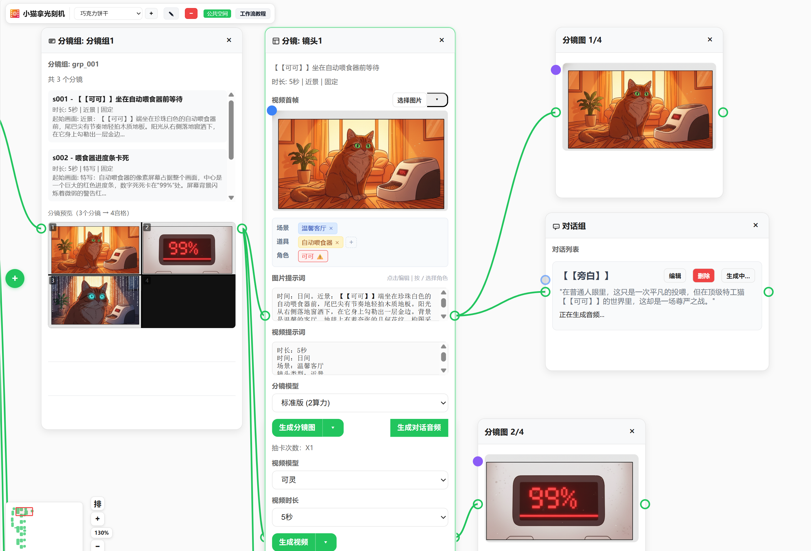
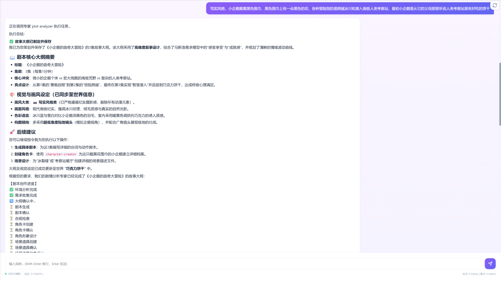
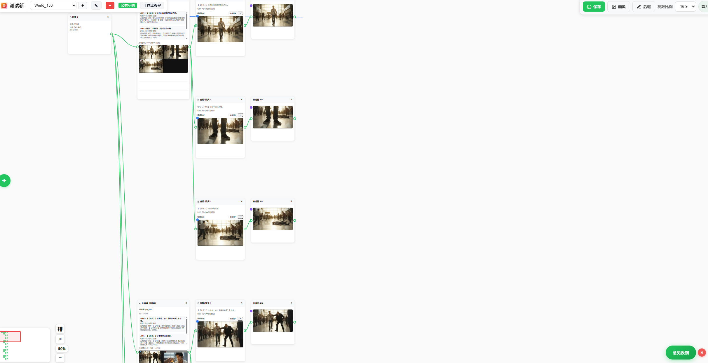

# 智剧通 AI短剧制作平台

[English](README_EN.md) | 中文

智剧通是一个基于 AI 的短剧制作平台，提供剧本创作、角色管理、视频生成、音频合成等一站式短剧制作解决方案。

## 目录

- [主要功能](#主要功能)
- [📦 用户指南](#-用户指南)
  - [快速开始（Windows）](#快速开始windows)
  - [常见问题（用户）](#常见问题用户)
- [🛠️ 开发者指南](#️-开发者指南)
- [开源协议](#开源协议)
- [联系我们](#联系我们)

## 主要功能

### 1. 全流程自动化剧本与分镜制作

实现剧本、分镜制作全流程自动化，一键拆分剧本节点、自动解析填充提示词，智能匹配场景、角色与道具；自动生成并适配多宫格分镜图，保障分镜一致性且节省算力，零基础可完成核心创作。支持配置角色形象图，确保角色跨分镜、场景形象统一，彻底解决 AI 短剧角色 "脸崩" 问题，大幅提升成片质感。

### 2. AI 智能体打造爆款剧本

由专业智能体团队协同运作的剧本智能体，支持对话式完成剧本新建、续写与小说改编全流程；自动完成大纲、剧本、角色、场景道具的设计生成及合规校验，操作极简。智能生成悬念钩子与情感曲线分析，精准把控观众情绪，高效提升短剧完播率。

### 3. 专业级无限画布创作

搭载兼具便捷性与专业性的无限画布，为剧本分镜创作提供灵活专业的创作空间，高效适配多宫格分镜的生成、拆分与布局，让分镜创作更专业、操作更省心。

### 4. 无界化团队协同

免安装，浏览器端直接使用；支持局域网部署与公网远程协作，团队成员随时随地实时共创。

### 5. 灵活算力与密钥管理

支持多供应商密钥配置，内置多用户独立算力计费体系，可绑定个人微信支付，适配多样创作需求。

### 6. 实战验证 + 免费开源

已完成红果平台短剧制作与上线，视频、图片生成稳定性经真实项目检验。源码开源，支持用户自主开发、个性化定制功能。

### 7. 开箱即用零门槛

内置免费图床、精选提示词库、TTS 语音服务，无需繁琐配置，注册即可创作。

### 8. 工程级稳定可靠

全接口单元测试覆盖，系统稳定性强，保障创作过程不中断。

---

# 📦 用户指南

> 如果你只是想使用智剧通，请阅读本章节。

📖 **完整教程**：[飞书文档](https://bq3mlz1jiae.feishu.cn/wiki/W1h2wCK3mi1CgDk36LEcVqggnLe)

🌐 **在线演示**：[ailive.perseids.cn](http://ailive.perseids.cn)

## 快速开始（Windows）

### 启动服务

**双击 `点我启动.exe` 即可**：

- ✅ 系统托盘图标显示启动状态
- ✅ 服务就绪后自动打开浏览器
- ✅ 右键菜单支持：打开浏览器、查看日志、退出
- ✅ 退出时自动停止所有服务

首次启动会自动创建配置文件 `config.yml`，一般无需修改。

### 访问地址

- 前端首页：`http://localhost:9003/`

### 停止服务

- 右键系统托盘图标 → 退出
- 或双击 `stop.bat`

## 常见问题（用户）

- **点我启动.exe 提示已在运行** - 检查系统托盘是否已有图标
- **无法打开网页** - 等待启动完成，或检查端口是否被占用
- **服务异常** - 查看 `logs/` 目录下的日志文件

---

# 🛠️ 开发者指南

如果你需要修改代码或参与开发，请阅读 **[开发者文档](docs/README.md)**，包含：

- 环境要求与安装依赖
- 多种启动方式（Windows/Linux/macOS）
- 配置说明
- 目录结构
- 常见问题

---

## 开源协议

本项目采用修改版 Apache License 2.0 协议，详见 [LICENSE](LICENSE)。

主要条款：
- ✅ 允许商业使用
- ✅ 允许修改和分发
- ❌ 未经授权不能运营多空间服务
- ❌ 不能移除前端 LOGO 和版权信息

## 联系我们

如有问题或建议，欢迎通过以下方式联系：

📧 **邮箱**：jeffstric@qq.com

| 微信群 | 个人微信 |
|:---:|:---:|
|  |  |
| 扫码加入交流群 | 扫码添加作者 |

© 2025 智剧通. All rights reserved.
